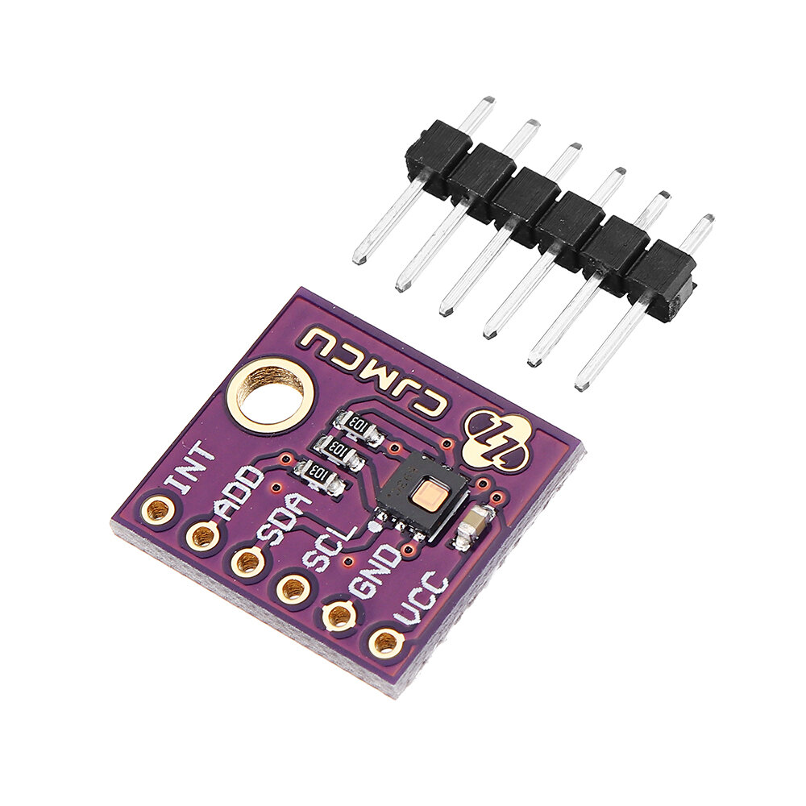

# ATENÇÃO 

Oi sou uma pagina de teste



| First Header | Second Header | Third Header |
| ------------ | ------------- | ------------ |
| Content Cell | Content Cell  | Content Cell |
| Content Cell | Content Cell  | Content Cell |

````
let i2c=global.get("i2c");
const HDC2080_I2C = 0x40;

const hdc = i2c.openSync(1);
hdc.writeByteSync(HDC2080_I2C, 0x0E, 0x46);
hdc.closeSync();

return msg;
````
